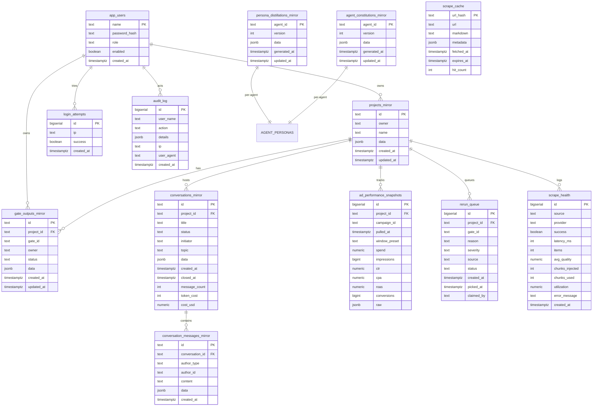

# Database Schema — current state

All Postgres tables are created lazily via `CREATE TABLE IF NOT EXISTS` in the routes that first use them. No Drizzle-managed schema file is authoritative — the routes ARE the schema.

## Mermaid — Neon tables

## IndexedDB stores (client-side, version 10)

| Store | KeyPath | Indexes | Phase |
| - | - | - | - |
| `projects` | `id` | `by-updated` | v1 |
| `gateOutputs` | `_key` | `by-project` | v1 |
| `images` | `id` | `by-project` | v1 |
| `knowledge` | `id` | `by-source`, `by-category` | v2 |
| `trainingSources` | `id` | — | v2 |
| `agentMemory` | `id` | `by-agent`, `by-project` | v2 |
| `trainingChunks` | `id` | `by-source`, `by-similarity-hash` (v10) | v3 / v10 |
| `goldOutputs` | `id` | `by-gate`, `by-niche`, `by-project` | v4 |
| `learningProfile` | `id` | — | v4 |
| `templates` | `id` | `by-project`, `by-category` | v5 |
| `videoAds` | `id` | `by-project` | v6 |
| `swipeVault` | `id` | `by-status`, `by-niche`, `by-format`, `by-awareness` | v7 |
| `personaDistillations` | `agentId` | — | v8 (Phase U.1) |
| `agentConstitutions` | `agentId` | — | v8 (Phase U.2) |
| `scoutLedger` | `id` | `by-project`, `by-day` | v8 (Phase U.3) |
| `conversations` | `id` | `by-project`, `by-status` | v9 (Phase V) |
| `conversationMessages` | `id` | `by-conversation` | v9 (Phase V) |

Source of truth: `src/lib/store/db.ts`.
